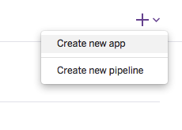
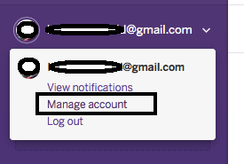
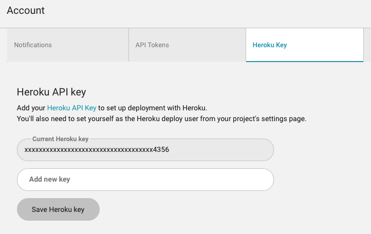
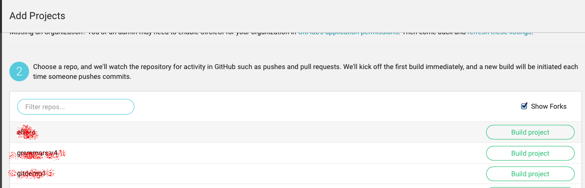
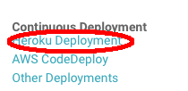
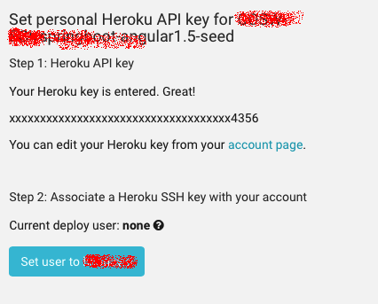

## Despliegue continuo de aplicaciones SpringBoot con CircleCI y Heroku

[Documentación CircleCI para Heroku:](https://circleci.com/docs/continuous-deployment-with-heroku)


1. Cree (si no la tiene aún) una cuenta en el proveedor PAAS Heroku ([www.heroku.com](www.heroku.com)).
2. Acceda a su cuenta en Heroku y cree una nueva aplicación:

	

3. Después de crear su cuenta en Heroku y la respectiva aplicación, genere una llave de API: Opción Manage Account:

	
	
	Opción API Key:
	

4. Ingrese a la plataforma de integración contínua Circle.CI ([www.circleci.com](www.circleci.com)). Para ingresar, basta que se autentique con su usuario de GitHUB.

5. Ingrese a las opciones generales de su cuenta y registre la llave de Heroku. Con esto, CircleCI tendrá privilegios para hacer despliegue automático.

	
	

6. Conecte su aplicación con el ambiente de integración contínua. Abra la opción de 'agregar proyecto':

	
	
	Seleccione su proyecto, y seleccione 'build project'.
	
	

	
7. En CircleCI, seleccione el proyecto recién agregado, abra su menú de opciones y seleccione las opciones de despliegue de Heroku:

	
	

	Verifique que ya esté registrada la llave del API. Luego, asocie el 'usuario de despliegue' (Step 2):

	

8. Si todo queda correctamente configurado, cada vez que hagan un PUSH al repositorio, CircleCI ejecutará la fase de construcción del proyecto. Para que cuando las pruebas pasen automáticamente se despliegue en Heroku, deben definir en el archivo circle.yml (ubicado en la raíz del proyecto):
	* La rama del repositorio de GitHUB que se desplegará en Heroku. o El nombre de la aplicación de Heroku en la que se hará el
despliegue.
	* La ejecución de la fase ‘site’ de Maven, para generar la
documentación de pruebas, cubrimiento de pruebas y análisis estático (cuando las mismas sean habilitadas).

	Ejemplo:
	[https://github.com/PDSW-ECI/base-proyectos/blob/master/circle.yml](https://github.com/PDSW-ECI/base-proyectos/blob/master/circle.yml)


9. Rectifique que en el pom.xml, en la fase de construcción, se tenga el siguiente plugin (es decir, dentro de <build><plugins>):

	```xml
	<build>  
	    <plugins>
	        <plugin>
	            <groupId>org.springframework.boot</groupId>
	            <artifactId>spring-boot-maven-plugin</artifactId>
	        </plugin>
	    </plugins>
	</build>  

 	```           
	
	Nota: Si en el pom.xml ya hay otro plugin con el mismo <groupId> y <artifactId>, reemplácelo por el anteriormente mostrado.

10. Heroku requiere los siguientes archivos de configuración (con sus respectivos contenidos) en el directorio raíz del proyecto, de manera que sea qué versión de Java utilizar, y cómo iniciar la aplicación, respectivamente:

	system.properties

	```
	java.runtime.version=1.8
	```

	Procfile 

	```
	web: java $JAVA_OPTS -Dserver.port=$PORT -jar target/*.jar 

	```

10. El ambiente de despliegue contínuo requiere también un archivo de configuración 'circle.yml' en la raíz del proyecto, en el cual se indica (entre otras cosas) en qué aplicación de Heroku se debe desplegar la aplicación que está en GitHUB. Puede basarse en el siguiente archivo, teniendo en cuenta que se debe ajustar el parámetro 'appname': [https://github.com/PDSW-ECI/base-proyectos/blob/master/circle.yml](https://github.com/PDSW-ECI/base-proyectos/blob/master/circle.yml)


6. Haga commit y push de su repositorio local a GitHub. Abra la consola de CircleCI y verifique que el de descarga, compilación, y despliegue. Igualmente, verifique que la aplicación haya sido desplegada en Heroku.

